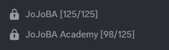
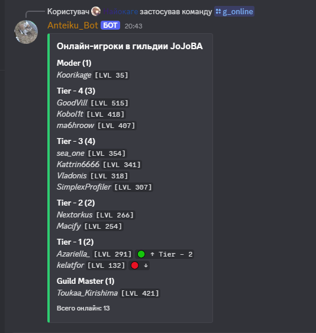
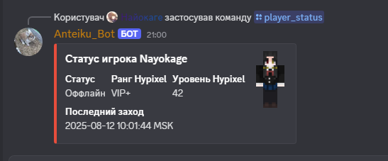
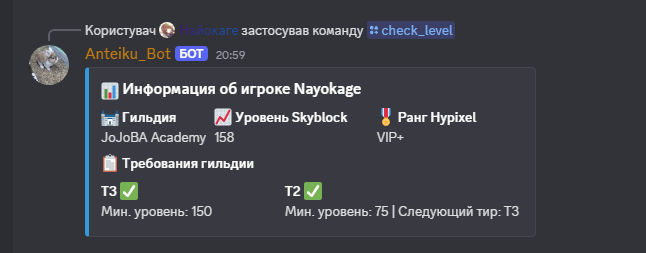

# Jojoba-Anteiku_Bot
  <a href="https://discord.gg/ZeqUqSjVAt"></a>
</p>

> **Внимания** Данный Репозиторий используетца для отображения Функциона и публикации обновления

## Список Функционала бота

- 🏰 **Автообновления Войсов** - Бот автоматически обновляет Количество Учасников в Гильдиях **Пример** 
- 🎯 **Авто проверка Критерий** - Бот автоматически проверяет через Hypixel API Уровень SkyBlock и показывает Участиков Какие потходят по Критериям или нет **Пример** 
- 🎮 **Проверка Статус Игрока** - Бот Смотрит и показывает Данные о Игроке Такие как В Сети или нет,Ранг Человека,Хайпиксель Уровень,И Когда Последний раз заходил **Пример** 
- ⚔️ **Информация о Игроке** - Бот показывает такую Информацию Гильдия,SkyBlock Уровень,Ранг Человека,и Проверка Требований в Гильдии **Пример** 

### 📊 Команды бота
- `/check_level` - Проверить уровень игрока в гильдии
- `/g_online` - Показать онлайн участников гильдии с готовым выбором гильдий
- `/g_o` - Показать онлайн Учасников Гильдии по Названию Гильдии
- `/player_status` - Статус игрока на Hypixel


### Голосовые каналы гильдий
Бот автоматически обновляет голосовые каналы для каждой гильдии:

```
JoJoBA [125/125] - Обновляется каждые 5 минут
JoJoBA Academy [99/125] - Обновляется каждые 5 минут
```

**Как это работает:**
1. Бот проверяет количество участников в гильдии через Hypixel API
2. Обновляет голосовые каналы с названиями вида `Гильдия [в Гильдии/Максимум]`

### Онлайн статус
- **Проверка статуса игроков:** каждые 30 секунд
- **Обновление гильдий:** каждые 5 минут
